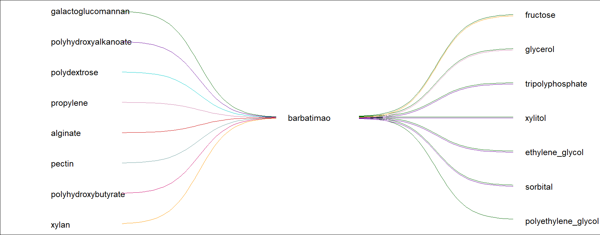

# Seaweed-Based Bioplastics: Data Mining Ingredient-Property Relations from Scientific Literature

## Overview
This project explores relationships between ingredients and properties in seaweed-based bioplastics using data mining and unsupervised NLP models. The goal is to accelerate the identification and development of new materials.

## Data
We collected 2,000 abstracts focused on seaweed-based bioplastics to build a Bag of Words representation, capturing details on ingredients, conditions, and properties. This dataset supports the training and validation of our models, enabling the analysis of ingredient-property relationships. The data used in this study is available in:

         Master Abstract List.xlsx.

## Python Folder
Contains scripts for:
- `cooccurence_ing_vs_prop.ipynb`: Co-occurrence matrix analysis (ingredient-property and ingredient-ingredient relationships).
- `reshaped_ing_vs_ing_matrix.ipynb`: Bayesian classification to identify the most relevant features from the co-occurrence matrix.
- `Matbert.ipynb`: We use the MatBERT model to analyze relationships between ingredients and properties in seaweed-based bioplastics. The notebook loads pretrained models and tokenizers, processes data from Excel, and experiments with NLP to complete sentences and evaluate ingredient combinations that optimize properties like water vapor permeability.
  
Install the dependencies of the project with:

        pip install -r requirements.txt

## Compound Categories
- **Compound1**: List of all polysaccharides
- **Compound2**: List of all additives (organic and inorganic)
- **Compound3**: List of all plasticizer materials

## Sentence Analysis
The film generated by mixtures {Compound1} and {Compound2}. By adding {Compound3}, [MASK] in their water vapor permeability.

This image shows the best-scoring combinations using MatBERT: the first column is the compound (Compound1), the second is additives (Compound2), and the third is the best plasticizer (Compound3).

## References
The code was developed by Thulasi Bikku (PhD in Computer Science) and Fernanda Véliz (Bachelor of Science in Computer Science).
